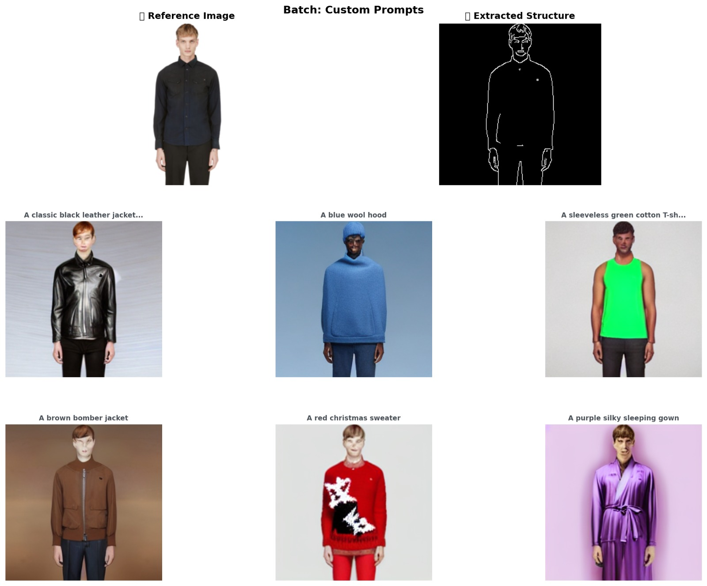

<div align="center">

# ATELIER

### A controllable diffusion studio, tailored for fashion.

*Generate brand-new garments from a written brief while preserving the silhouette of any reference photo — and watch the diffusion model think, step by step.*

<br />


<br />



<sub><em>One reference image · six text prompts · six garments that share its silhouette.</em></sub>

</div>

---

## Table of Contents

- [Why this exists](#why-this-exists)
- [What you get](#what-you-get)
- [The wow moment: a live diffusion theatre](#the-wow-moment-a-live-diffusion-theatre)
- [Architecture](#architecture)
- [The model](#the-model)
- [Training](#training)
- [The runtime](#the-runtime)
- [The interface](#the-interface)
- [Performance](#performance)
- [Quick start](#quick-start)
- [Project structure](#project-structure)
- [Tech stack](#tech-stack)
- [Roadmap](#roadmap)
- [Credits & references](#credits--references)
- [License](#license)

---

## Why this exists

Vanilla text-to-image models can paint a beautiful jacket. They cannot paint *this exact jacket in a different fabric* — the silhouette, the drape, the seam structure all shift the moment you swap "navy wool" for "black leather." For a fashion designer iterating on a sketch or a stylist mocking up an editorial, that's a deal-breaker.

ATELIER closes the gap by stacking three ideas:

1. **Stable Diffusion v1.5** as the generative base — high-fidelity, latent-space, computationally tractable.
2. **ControlNet (Canny)** to lock the geometry — every generation honours the edge map of the reference photo, so the silhouette is preserved.
3. **LoRA fine-tuning on FashionGen** to teach the model fashion-specific texture, lighting, and terminology — without retraining a single weight of the base diffusion model.

The result is a system that respects designer intent: same garment shape, new everything else.

---

## What you get

- **Single-image generation** — pick a reference, write a brief, ship a render in ~5 seconds on a consumer RTX.
- **Custom uploads** — drop your own photo; aspect ratio is preserved end-to-end (no squishing).
- **Curated reference library** — 43 editorial and catalog samples shipped, more drop-in.
- **Prompt presets** — Outerwear · Tops · Dresses · Bottoms, 19 garments out of the box.
- **A persistent lookbook** — every generation auto-archives to your browser, with seed, CFG, and aspect retained for reproducibility.
- **Full evaluation suite** — FID, KID, LPIPS, CLIP Score, computed against held-out FashionGen samples in the training notebooks.
- **Two backends, one frontend** — train on a free Kaggle T4 *or* an AMD ROCm cluster, serve from a local NVIDIA box, point any web client at it.

---

## The wow moment: a live diffusion theatre

Every other diffusion demo hides what the model is actually doing. ATELIER turns it into the centrepiece.

When you hit **Generate**, the page glides down into a dark editorial theatre where four stages animate in real time:

| Stage | What you see | What it actually is |
|---|---|---|
| **Deconstruction** | The reference photo blurs, scales out, and dissolves into a glowing Canny skeleton | `cv2.Canny` running on the resized input, served as a base64 PNG in the SSE `ready` event |
| **Noise field** | The edge map sits behind a procedural film-grain overlay | Frontend cosmetic — an SVG `feTurbulence` background |
| **Denoising timeline** | Thumbnails populate left-to-right as the model denoises; a big central canvas morphs from noise → form | **Real** per-step previews: a `diffusers` `callback_on_step_end` decodes the live latent tensor through the VAE every 2 steps and pushes a JPEG over the stream |
| **Shutter reveal** | The final image swipes in left-to-right behind a clip-path mask, settling into a three-up *Reference · Structure · Generated* composition | Final image from the SSE `done` event with framer-motion's `clipPath` keyframe |

The thumbnails are not pre-rendered. They are *honest* visual decodes of what the U-Net is thinking at step *k*.

---

## Architecture

```
┌──────────────────────────────────────────────────────────────────────────┐
│                              BROWSER (any device)                        │
│  ┌────────────────────────────────────────────────────────────────────┐  │
│  │  React 19 + Vite 5 + Tailwind 3 + framer-motion                    │  │
│  │  ─────────────────────────────────────────────────                 │  │
│  │  Studio • Generation Theatre • Lookbook • About                    │  │
│  │  EventSource(/generate/stream) ⟵ live SSE preview frames           │  │
│  └────────────────────────────────────────────────────────────────────┘  │
└──────────────────────────────┬───────────────────────────────────────────┘
                               │ HTTPS / SSE
                               ▼
┌──────────────────────────────────────────────────────────────────────────┐
│                       FastAPI (uvicorn, async)                           │
│  GET  /health          model + GPU status                                │
│  GET  /samples         curated reference library                         │
│  POST /generate        one-shot synchronous generation                   │
│  GET  /generate/stream Server-Sent Events: ready → step* → done          │
└──────────────────────────────┬───────────────────────────────────────────┘
                               │
                               ▼
┌──────────────────────────────────────────────────────────────────────────┐
│           PyTorch + diffusers · NVIDIA GPU · fp16 · single instance      │
│                                                                          │
│   reference ──► Canny ──► ControlNet (Canny v1.1p sd15, frozen)          │
│                                              │                           │
│   prompt ────► CLIP ─────────────────────►   ▼                           │
│                                       Stable Diffusion v1.5 U-Net        │
│                                       + LoRA adapter (rank 4)            │
│                                              │                           │
│                                              ▼                           │
│                          VAE decoder ──► PNG image                       │
│                          (also tapped every 2 steps for previews)        │
└──────────────────────────────────────────────────────────────────────────┘
```

---

## The model

| Component | Role | Parameters | State |
|---|---|---:|---|
| **Stable Diffusion v1.5** (`runwayml/stable-diffusion-v1-5`) | Latent text-to-image generative core | ~860 M | ❄️ Frozen |
| **ControlNet** (`lllyasviel/control_v11p_sd15_canny`) | Spatial conditioning from Canny edges | ~1.4 B | ❄️ Frozen |
| **LoRA adapter** (custom, trained on FashionGen) | Fashion-domain adaptation injected into U-Net cross-attention layers | ~4 M | ✅ **Trained** |
| **CLIP text encoder** (bundled with SD 1.5) | Prompt → 77×768 embeddings | ~123 M | ❄️ Frozen |
| **VAE** (bundled with SD 1.5) | Latent ↔ pixel | ~83 M | ❄️ Frozen |
| **UniPCMultistepScheduler** | Sampler — fast, deterministic, 20-step quality | — | — |

Three LoRA variants are shipped under `Img-synthesis/assets/weights/Model_weights_for_inference/`:

| Variant | Training samples | Eval samples | Inference steps | Use case |
|---|---:|---:|---:|---|
| `fashion_image_generation_30k+3k_denoising20` *(default)* | 30 000 | 3 000 | 20 | Balanced quality/speed |
| `fashion_image_generation_30k+3k_denoising40` | 30 000 | 3 000 | 40 | Highest fidelity, ~2× slower |
| `fashion_image_generation_5k+0.5k_denoising20` | 5 000 | 500 | 20 | Lightweight smoke test |

---

## Training

The whole training pipeline ships as reproducible Jupyter notebooks for both **AMD ROCm** (MI250X cluster) and **Kaggle NVIDIA T4** (free tier). See `Img-synthesis/controllable-fashion-image-synthesis-project-{AMD,kaggle}/`.

### Hyperparameters

| Parameter | Value | Notes |
|---|---|---|
| Learning rate | `1e-4` | AdamW |
| Schedule | Cosine, 500-step warmup | |
| Max steps | 5 000 | Loss plateaus ~3 000 |
| Batch size | 2 per GPU | Gradient accumulation 2 → effective 4 |
| Resolution | 256 × 256 | Aspect-preserving at inference |
| Precision | FP32 | ROCm/Kaggle parity (`bitsandbytes` excluded) |
| LoRA rank / alpha | 4 / 4 | ~4 M trainable params |
| Max grad norm | 1.0 | Clipping |
| Random flip | ✅ | Horizontal only |
| Seed | 42 | Reproducible |
| Checkpoint every | 1 000 steps | |

### Dataset

[**FashionGen**](https://www.elementai.com/news/2018/fashion-gen-an-original-dataset-for-fashion-tasks) — high-resolution garment photography paired with rich, professionally-written product descriptions. Pre-processing extracts (image, caption) tuples from the HDF5 file and emits a CSV that the standard `diffusers` `train_text_to_image_lora.py` script can consume.

### Evaluation

| Metric | What it tells us | Direction |
|---|---|---|
| **FID** (Fréchet Inception Distance) | Image realism vs. real fashion distribution | Lower = better |
| **KID** (Kernel Inception Distance) | Distributional similarity, robust on small sets | Lower = better |
| **LPIPS** (Learned Perceptual Image Patch Similarity) | Perceptual closeness via AlexNet features | Lower = better |
| **CLIP Score** | Text ↔ image semantic alignment | Higher = better |

Metrics are computed against a held-out 3 k / 500-sample FashionGen split in `controllable-fashion-image-synthesis-v1-evaluation.ipynb`.

---

## The runtime

### Backend (`atelier-backend/`)

**FastAPI + uvicorn**, single-worker on purpose (one GPU, one generation at a time, serialized through an `asyncio.Lock`).

The non-obvious piece is the **per-step streaming**. Every diffusion step, `diffusers` fires a `callback_on_step_end(step_idx, timestep, callback_kwargs)`. We:

1. Grab the live `latents` tensor from `callback_kwargs`.
2. Decode it through the pipeline's VAE — yes, an extra VAE forward pass, throttled to every Nth step (`preview_every=2`) to stay cheap.
3. Convert the decoded image to a base64 JPEG (smaller than PNG for previews).
4. Push it onto a thread-safe `asyncio.Queue` via `loop.call_soon_threadsafe`.
5. The SSE generator drains the queue and emits `step` events.

```python
def diffusers_callback(pipe_, step_index, timestep, callback_kwargs):
    latents = callback_kwargs.get("latents")
    if (step_index + 1) % preview_every == 0:
        preview = latents_to_pil(pipe_, latents)
        put("step", {"index": step_index + 1, "total": req.steps,
                     "preview_b64": pil_to_b64(preview, "JPEG")})
    return callback_kwargs
```

### Endpoints

| Endpoint | Purpose |
|---|---|
| `GET /health` | Device, dtype, VRAM, loaded LoRA, pipeline status |
| `GET /samples` | List of curated reference image IDs |
| `GET /samples/{id}` | Static image bytes |
| `POST /generate` | Synchronous generation, returns final base64 PNG |
| `GET /generate/stream` | **SSE** stream of `ready` → `step` (×N) → `done`/`error` |

### Aspect-ratio handling

The original implementation center-cropped every input to 256². ATELIER instead **preserves aspect ratio**: the longer side is set to 256, the shorter side is computed proportionally, both rounded to a multiple of 8 (a Stable Diffusion U-Net requirement). A 600 × 800 portrait becomes 192 × 256 — a true portrait output, no squishing, no lost legs.

---

## The interface

Designed in [Google Stitch](https://stitch.withgoogle.com) (Playfair Display × Geist, bone/champagne/black editorial palette, hairline borders, Material You-style design tokens), then ported into React with all the runtime behaviour wired up.

Three sections, one page:

1. **Studio** — sample picker on the left, control deck on the right (Category → Preset → prompt → advanced sliders → Generate). Sticky positioning, smooth scroll to the theatre on click.
2. **Generation Theatre** — the four-stage live animation described above.
3. **Lookbook Archive** — every completed generation persists to `localStorage` (24 most recent), shown in a staggered three-column grid with serif italic captions.

Plus an editorial **About** section that introduces the architecture and training specs in the same visual language.

---

## Performance

Benchmarked on an **NVIDIA RTX 4070 Laptop GPU** (8 GB VRAM), Windows 11, Python 3.12:

| Operation | Time | Notes |
|---|---:|---|
| Cold model load (cached) | ~7 s | SD 1.5 + ControlNet + LoRA |
| `/generate` 20 steps, fp16 | **~5.3 s** end-to-end | HTTP round-trip included |
| `/generate/stream` 20 steps, 6 previews | **~4.1 s** wall · 2.0 s pure GPU | Including 6 VAE preview decodes |
| Single preview frame | ~22 KB | base64 JPEG |
| Single final image | ~50–80 KB | base64 PNG |
| Steady-state VRAM | ~5.5 GB | fits comfortably in 8 GB |

For comparison, Kaggle's free T4 runs the same generation in 15–30 seconds.

---

## Quick start

### Prerequisites

- **Python 3.10+** with PyTorch + CUDA already working
- **Node 18+** (Node 20.19+ recommended)
- **NVIDIA GPU** with ≥ 6 GB VRAM (or any CUDA-capable GPU; the model is tiny by modern standards)
- ~6 GB free disk for the Hugging Face model cache (one-time download)

### Backend

```bash
cd atelier-backend
pip install -r requirements.txt
python populate_samples.py           # one-time: pulls 41 reference images from Unsplash
python server.py                     # listens on http://localhost:8001
```

First run will download Stable Diffusion v1.5 (4 GB) and ControlNet Canny (1.4 GB) to `~/.cache/huggingface/`. Subsequent restarts take ~7 seconds.

### Frontend

```bash
cd atelier-frontend
cp .env.example .env                 # default points at http://localhost:8001
npm install
npm run dev                          # http://localhost:5173
```

Open `http://localhost:5173` in your browser. Backend `/health` is polled automatically — when the dot turns gold and the status reads *Model · Ready*, you're good.

### Training your own LoRA (optional)

```bash
# Open one of these in Jupyter and run all cells:
Img-synthesis/controllable-fashion-image-synthesis-project-AMD/controllable-fashion-image-synthesis-v1.ipynb
# or one of the Kaggle variants under .../project-kaggle/
```

Drop your trained `pytorch_lora_weights.safetensors` into a folder under `Img-synthesis/assets/weights/Model_weights_for_inference/` and point the backend at it via the `DEFAULT_LORA_DIR` constant in `server.py`.

---

## Project structure

```
.
├── atelier-backend/                   FastAPI + diffusers serving layer
│   ├── server.py                      Pipeline, endpoints, SSE callback
│   ├── populate_samples.py            One-shot fashion-image scraper
│   ├── samples/                       43 reference images (PNG)
│   ├── test.html                      Bare-HTML dev tester (no React needed)
│   └── requirements.txt
│
├── atelier-frontend/                  Vite + React + Tailwind editorial UI
│   ├── src/
│   │   ├── App.tsx                    Page composition + scroll-to-theatre
│   │   ├── api.ts                     Typed wrapper over backend endpoints
│   │   ├── presets.ts                 19 garment prompts across 4 categories
│   │   ├── hooks/
│   │   │   ├── useGeneration.ts       SSE state machine — the real wiring
│   │   │   ├── useHealth.ts           Backend status poller
│   │   │   └── useLookbook.ts         localStorage-backed history
│   │   ├── components/
│   │   │   ├── TopBar.tsx
│   │   │   ├── SamplePicker.tsx
│   │   │   ├── ControlDeck.tsx
│   │   │   ├── GenerationTheatre.tsx  The live denoising animation
│   │   │   ├── LookbookArchive.tsx
│   │   │   ├── AboutSection.tsx
│   │   │   └── Footer.tsx
│   │   └── types.ts
│   ├── tailwind.config.js             Stitch design tokens (colors, fonts, spacing)
│   └── index.html
│
├── atelier-frontend-stitch/           Original Stitch HTML exports (design source of truth)
│
├── Img-synthesis/                     Original research project (training + evaluation)
│   ├── assets/
│   │   ├── images/                    Sample outputs from training runs
│   │   └── weights/Model_weights_for_inference/
│   │       ├── fashion_image_generation_30k+3k_denoising20/
│   │       ├── fashion_image_generation_30k+3k_denoising40/
│   │       └── fashion_image_generation_5k+0.5k_denoising20/
│   ├── controllable-fashion-image-synthesis-project-AMD/        ROCm notebooks + setup
│   ├── controllable-fashion-image-synthesis-project-kaggle/     Kaggle T4 notebooks
│   ├── app.py                                                   Standalone Gradio (legacy)
│   └── README.md
│
├── Project-Documentation.{html,pdf}   Project writeup
├── Project_Proposal.docx              Initial proposal
├── generate_proposal.py               Proposal generator
└── README.md                          (this file)
```

---

## Tech stack

### Machine learning

- **PyTorch 2.5 + CUDA 12.1** — GPU inference
- **🤗 diffusers 0.30** — pipeline orchestration, scheduler, callbacks
- **🤗 transformers 4.44** — CLIP text encoder
- **🤗 PEFT 0.13** — LoRA adapter loading
- **🤗 accelerate 0.34** — training loop scaffolding
- **OpenCV 4** — Canny edge extraction
- **NumPy / Pillow / safetensors** — the usual suspects

### Backend

- **FastAPI 0.115** — async API server
- **uvicorn 0.32** — ASGI runtime
- **sse-starlette 2.1** — Server-Sent Events helper
- **Pydantic v2** — request validation

### Frontend

- **React 19** — component layer
- **Vite 5** — bundler + dev server
- **TypeScript** — strict mode, end-to-end types
- **Tailwind CSS 3.4** — design-token-driven utilities
- **framer-motion 11** — page-level animation choreography
- **Google Fonts** — Playfair Display × Geist + Geist Mono + Material Symbols

### Evaluation

- **clean-fid** — FID/KID with reproducible Inception weights
- **lpips** — perceptual similarity
- **torch-fidelity** — additional metric primitives

---

## Roadmap

- [ ] Replace the per-step VAE decode with **TAESD** (tiny autoencoder) — ~10× cheaper previews, frame-on-every-step.
- [ ] LoRA hot-swap endpoint — switch between the three trained variants in the UI without restarting.
- [ ] **4× upscaler** (Real-ESRGAN) post-step, so 256² outputs display at editorial 1024².
- [ ] Concurrency queue with live position indicator ("3 ahead of you").
- [ ] **ngrok static-domain** tunnel guide for free public hosting.
- [ ] Public deploy: Hugging Face Space (Docker) with paid T4 + sleep.
- [ ] Multi-condition control: depth + Canny + pose, simultaneously.
- [ ] Negative-prompt presets exposed in the UI.

---

## Credits & references

This project would not exist without the work of:

- **Robin Rombach et al.** — *High-Resolution Image Synthesis with Latent Diffusion Models* — [arXiv:2112.10752](https://arxiv.org/abs/2112.10752) — the foundation.
- **Lvmin Zhang & Maneesh Agrawala** — *Adding Conditional Control to Text-to-Image Diffusion Models* — [arXiv:2302.05543](https://arxiv.org/abs/2302.05543) — ControlNet.
- **Edward J. Hu et al. (Microsoft Research)** — *LoRA: Low-Rank Adaptation of Large Language Models* — [arXiv:2106.09685](https://arxiv.org/abs/2106.09685) — what makes the fine-tuning tractable.
- **Negar Rostamzadeh et al.** — *Fashion-Gen: The Generative Fashion Dataset and Challenge* — [arXiv:1806.08317](https://arxiv.org/abs/1806.08317) — the data.
- **Hugging Face** — `diffusers`, `transformers`, `accelerate`, `peft`. The serving layer would be ten times the code without them.
- **Stability AI · Runway** — open-weights Stable Diffusion v1.5.
- **lllyasviel** — the ControlNet implementation everyone actually uses.
- **Google Stitch** — the UI design surface.
- **Unsplash photographers** whose work appears in the reference picker.

---

## License

This project is a course-credit research deliverable and inherits the licenses of its dependencies:

- **Stable Diffusion v1.5** — [CreativeML Open RAIL-M](https://huggingface.co/spaces/CompVis/stable-diffusion-license)
- **ControlNet** — Apache 2.0
- **LoRA** — Apache 2.0
- **FashionGen** — research-only, see dataset card
- **Project-original code** (everything in `atelier-backend/`, `atelier-frontend/`, the notebooks under `Img-synthesis/`, and this README) — MIT

Please review and comply with all upstream licenses before any commercial use.

---

<div align="center">
<sub>Built with patience, vector math, and a refusal to ship beige UI.</sub>
</div>
